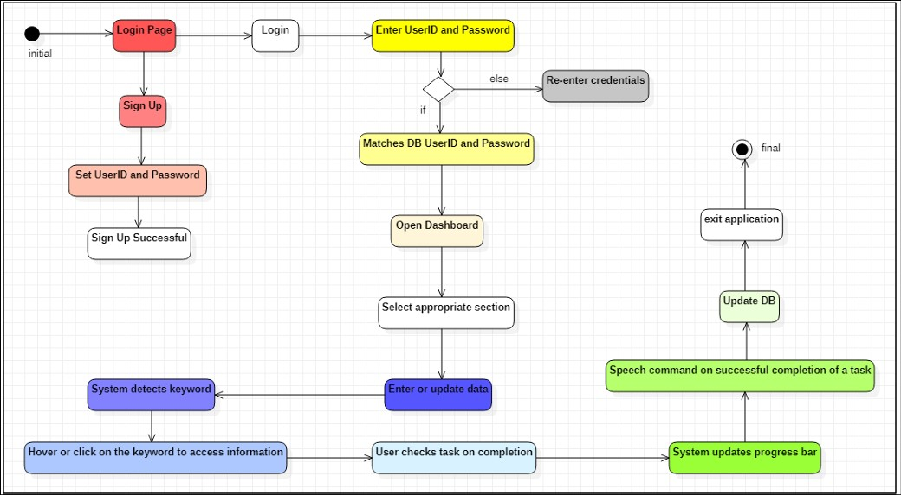
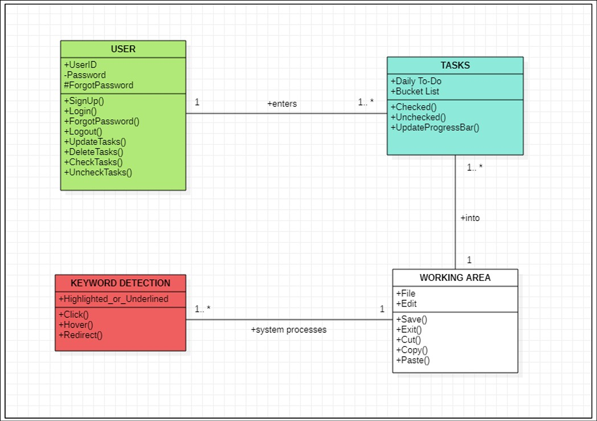
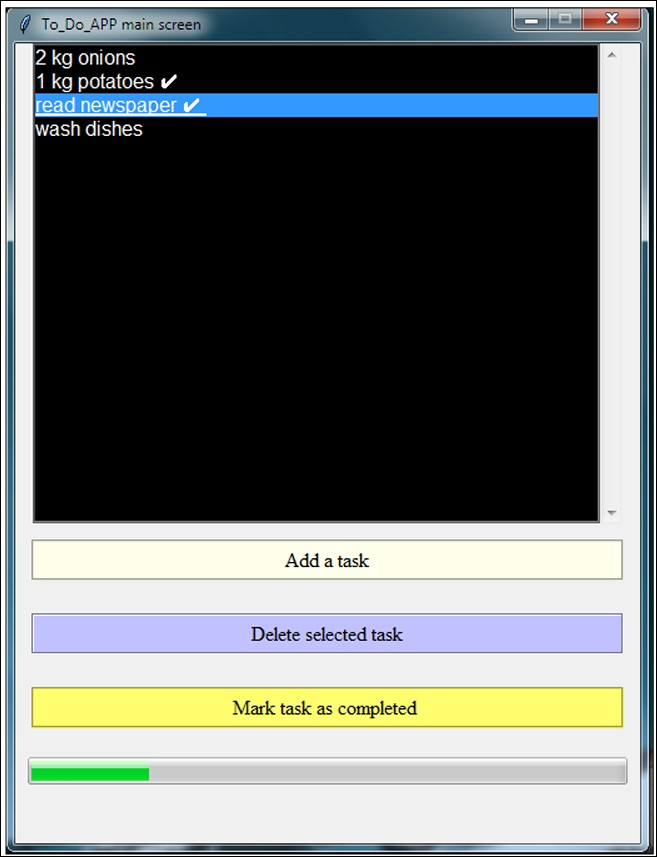
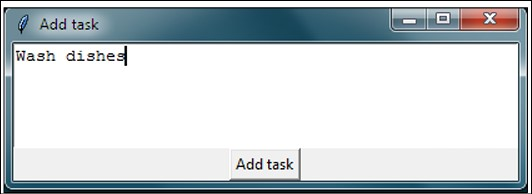
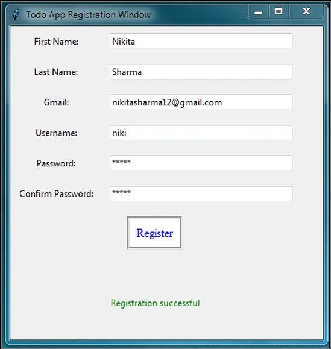
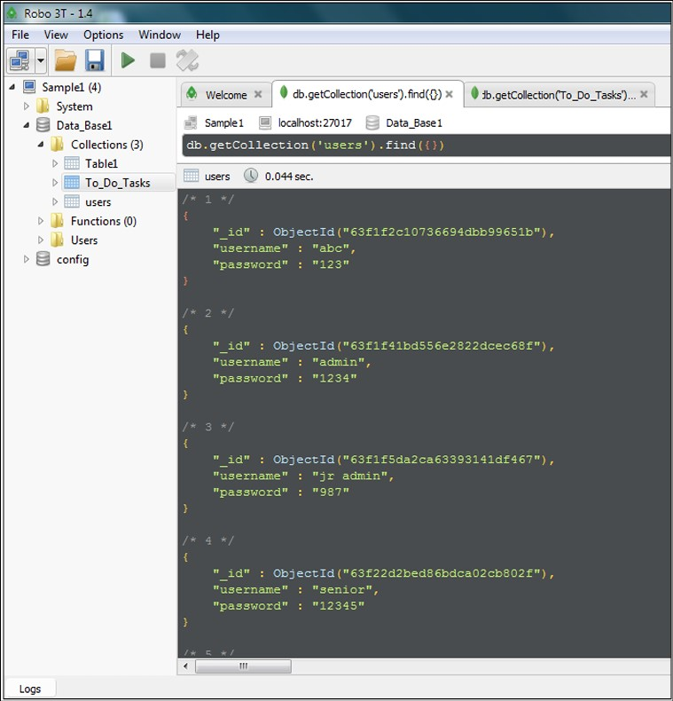
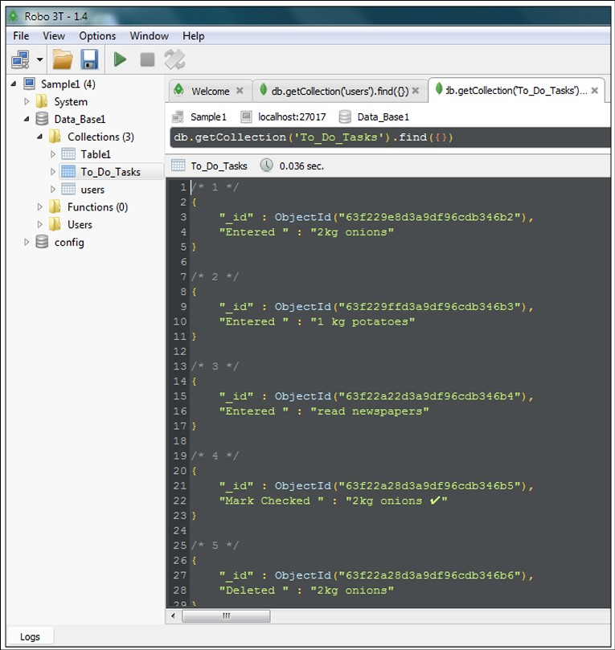

# ToDo_Application
A desktop application developed using Python Tkinter and MongoDb.

It will first ask the user to set login credentials, post which the user will have to select the 
category under which the user wishes to place the tasks. 
Entered tasks can be updated according to the user's requirements. After completing a task, the 
application will update the respective progress bar under each section. After accomplishing a 
task, a message will be conveyed to the user via speech, which will make the interface 
interactive. 

<br/>

## Technologies Used :
- **tkinter : Python GUI library**<br/><br/>
 customtkinter is an extension of the standard Tkinter library for Python, designed to provide a more modern and customizable interface. It adds new features and widgets that are not available in the standard Tkinter library, making it easier to create visually appealing and responsive user interfaces.
<br/><br/> Features of customtkinter : <br/>
Modern Look: Offers a more modern and sleek look for the widgets compared to the traditional Tkinter.<br/>
Customization: Provides more options for customizing the appearance of widgets, including colors, shapes, and styles.
<br/><br/> You can install customtkinter using pip : <br/>
``` pip install customtkinter ```
<br/><br/>

- **MongoDB : Database**  <br/>
MongoDB is a popular NoSQL database that stores data in JSON-like documents with a flexible schema. This makes it different from traditional relational databases, which store data in rows and columns.</br></br>
Download MongoDB:</br>
Go to the [MongoDB Download Center](https://www.mongodb.com/try/download/community) and select the version that matches your operating system.</br></br>
Install MongoDB:</br>
Run the downloaded installer and follow the installation wizard.</br>
During installation, you can select the "Complete" setup type to install all MongoDB components.</br>
Ensure that the option to install MongoDB as a service is checked.</br></br>
Set up MongoDB Environment:</br>
After installation, you need to create directories for data and logs.</br>
``` md \data\db``` ```md \data\log ``` </br></br>
Run MongoDB:</br>
Open a command prompt and start the MongoDB server by running:</br>
``` "C:\Program Files\MongoDB\Server\{your_version}\bin\mongod.exe" ```</br></br>
Connecting to MongoDB:</br>
To interact with MongoDB, you can use the MongoDB shell or a GUI tool like MongoDB Compass.</br></br>
Using MongoDB with Python</br>
```pip install pymongo```</br></br>
Python Script:</br>
``` from pymongo import MongoClient ```
 
</br>

## Software Requirements :
1. Operating system: Windows 7 or higher <br/>
2. Front end: Python 3.11 <br/>
3. Back end: MongoDB x86_64_7.00   <br/>

<br/>
<br/>


<br/>*Activity Diagram*

<br/>


<br/>*Class Diagram*

<br/>


<br/>*Application Main Screen*

<br/>


<br/>*Add Task Prompt*

<br/>


<br/>*User Registration Window*

<br/>


<br/>*Database Records : Users*

<br/>


<br/>*Database Records : Tasks*

<br/>

